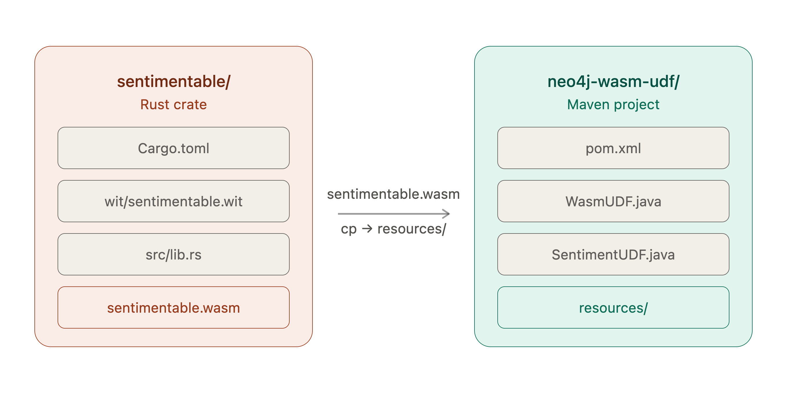
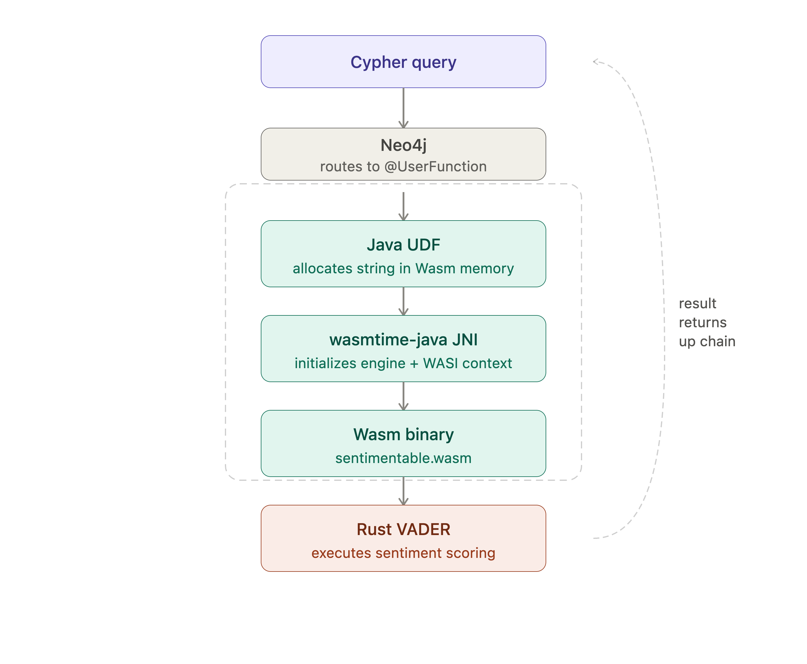
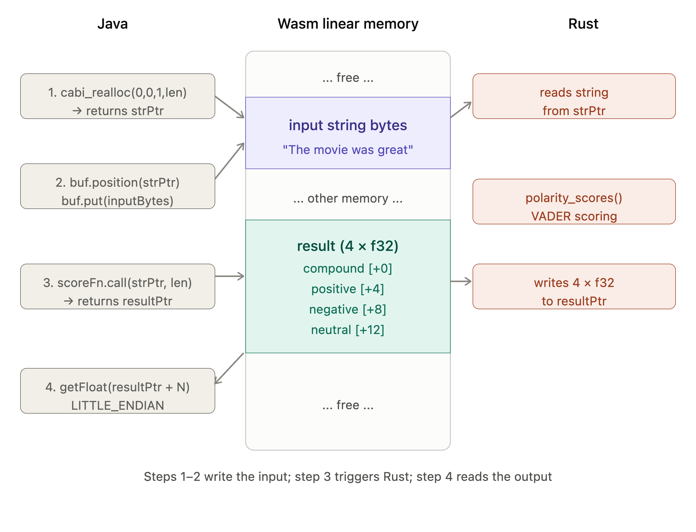
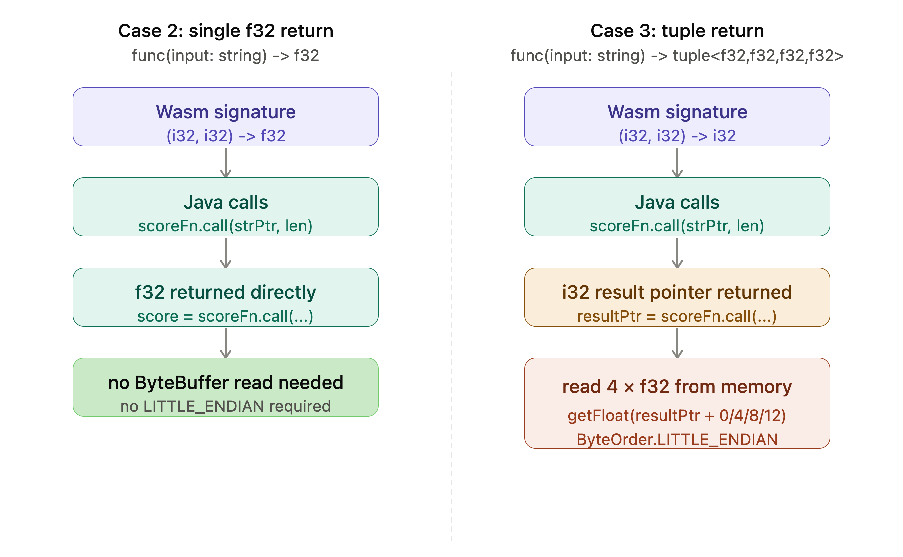

# Wasm Inside Neo4j: Building the Example That Didn't Exist

In a recent DZone article, [Running Sentiment Analysis Inside Neo4j With a Java Plugin](https://dzone.com/articles/neo4j-sentiment-analysis-java), we explored several approaches to running sentiment analysis inside the Neo4j database engine. One of those approaches — embedding a Wasm runtime inside a Java UDF — was described like this:

> Theoretically, we could embed a Wasm runtime such as `wasmtime` inside a Java UDF and execute the VADER Wasm module from within Neo4j, getting Wasm's sandbox guarantees inside Neo4j's plugin model. It's technically feasible but no published working example appears to exist and the complexity cost is high relative to the alternatives. An interesting idea to watch, but not practical today.

This article builds that working example.

We'll show the complete path from a trivial integer addition function through to a full VADER polarity score map, callable directly from Cypher. We'll cover all the tools and inspection techniques needed to understand what the Wasm compiler generates and why the Java calling convention looks the way it does.

The full source code is available on [GitHub](https://github.com/VeryFatBoy/neo4j/tree/main/wasm-udf).

## What We're Building

We're embedding a `wasmtime` Wasm runtime inside a Neo4j Java UDF using `wasmtime-java`, a community JNI binding for the Wasmtime runtime. It's not an official Bytecode Alliance product, but it ships prebuilt native libraries for all major platforms and is sufficient for this proof-of-concept. A Rust function compiled to WebAssembly rides inside the plugin JAR alongside the Java code. When Cypher calls the UDF, Java initializes the Wasm runtime, loads the binary and invokes the Rust function — all inside the Neo4j JVM process with no external API calls and no network round-trips.

**Note:** This article was tested specifically against `wasmtime-java` 0.19.0. The API used here is version-specific; newer releases or alternative JVM Wasm runtimes may expose different interfaces and calling conventions.

## Prerequisites

You'll need the following installed if you wish to follow along. We're using Apple Silicon (ARM64) as our development platform, so we'll note where the setup differs from other platforms.

### Java

We're using OpenJDK 21 (tested with `21.0.12.1`). Install it using your platform's package manager or download it directly from [adoptium.net](https://adoptium.net).

On macOS via Homebrew:

```bash
brew install openjdk@21
```

On Ubuntu/Debian:

```bash
sudo apt install openjdk-21-jdk
```

On Windows, download and run the installer from Adoptium.

Confirm your Java version:

```bash
java -version
```

You should see a Java 21 runtime. If you're on Apple Silicon, also confirm you're running a native ARM64 JVM with:

```bash
uname -m
```

You should see `arm64`. Not running under ARM64 will likely break the `wasmtime-java` JNI library loading.

### Maven

We're using Maven `3.9.6`. On Apple Silicon, be cautious about installing Maven via Homebrew as, at the time of writing, the Homebrew Maven formula pulls in OpenJDK 26 as a dependency, which conflicts with a Java 21 installation. If your package manager installs an incompatible JDK alongside Maven, verify the runtime with `mvn -version` and configure `JAVA_HOME` as necessary. Installing Maven manually is the safest approach:

```bash
cd ~
curl -O https://archive.apache.org/dist/maven/maven-3/3.9.6/binaries/apache-maven-3.9.6-bin.tar.gz
tar xzf apache-maven-3.9.6-bin.tar.gz
```

Then add Maven to your `PATH` and make it persist across terminal sessions:

```bash
echo 'export PATH="$HOME/apache-maven-3.9.6/bin:$PATH"' >> ~/.zshrc
source ~/.zshrc
```

- On Linux, add the same line to `~/.bashrc` instead.
- On Windows, download the zip from [maven.apache.org](https://maven.apache.org/download.cgi) and add the `bin` folder to your system `PATH` via System Properties.

Confirm Maven is using Java 21:

```bash
mvn -version
```

You should see `Java version: 21` in the output.

### Rust

We're using Rust `1.96.0`. Install via `rustup` if not already present:

```bash
curl --proto '=https' --tlsv1.2 -sSf https://sh.rustup.rs | sh
```

On Windows, download and run `rustup-init.exe` from [rustup.rs](https://rustup.rs).

To pin to the specific Rust version we tested with:

```bash
rustup toolchain install 1.96.0
rustup default 1.96.0
```

Then add the WASI target:

```bash
rustup target add wasm32-wasip1
```

This target works identically across macOS, Linux and Windows.

### WABT

The WebAssembly Binary Toolkit gives us `wat2wasm` for compiling WebAssembly Text format to binary and `wasm-objdump` for inspecting Wasm binaries. We tested with version `1.0.41`.

On macOS:

```bash
brew install wabt
```

On Ubuntu/Debian:

```bash
sudo apt install wabt
```

On Windows, download the latest release from [github.com/WebAssembly/wabt/releases](https://github.com/WebAssembly/wabt/releases).

Confirm the version after install:

```bash
wat2wasm --version
```

### wit-bindgen

This is the interface types generator for WebAssembly. There are two distinct version numbers to be aware of: the `wit-bindgen-cli` command-line tool and the `wit-bindgen` Rust crate used as a dependency inside the Wasm module. These can differ. We tested with CLI version `0.59.0` and Rust crate version `0.40.0` (specified in `Cargo.toml`). The generated binary identifies the crate version through the export name `cabi_realloc_wit_bindgen_0_40_0`. Install the pinned CLI version via Cargo on all platforms:

```bash
cargo install wit-bindgen-cli --version 0.59.0
```

Confirm it's installed:

```bash
wit-bindgen --version
```

### Neo4j Desktop

We're using Neo4j Desktop with a local database instance. Download from [Neo4j for Desktop](https://neo4j.com/download/).

The `pom.xml` in this article is pinned to Neo4j `2026.07.0` — update the `neo4j.version` property to match your own Desktop installation.

### `wasmtime-java` Platform Support

The `wasmtime-java` library ships prebuilt JNI native libraries for:

- macOS aarch64
- macOS x86\_64
- Linux aarch64
- Linux x86\_64
- Windows x86\_64

No additional setup is needed, as Maven pulls the correct native library for your platform automatically.

### Version Summary

For reference, here are all the component versions used in this article:

| Component | Version |
| --- | --- |
| OpenJDK | 21.0.12.1 |
| Maven | 3.9.6 |
| Rust | 1.96.0 |
| WABT | 1.0.41 |
| wit-bindgen CLI | 0.59.0 |
| wit-bindgen crate | 0.40.0 |
| vader\_sentiment crate | 0.1.1 |
| wasmtime-java | 0.19.0 |
| Neo4j | 2026.07.0 |

## Getting the Code

Clone the repository before following along. All source files are provided so you don't need to create them manually.

```bash
cd ~
git clone --filter=blob:none --sparse https://github.com/VeryFatBoy/neo4j.git
cd neo4j
git sparse-checkout set wasm-udf
mv wasm-udf ../wasm-udf
cd ../wasm-udf
```

## Project Structure

Before creating any files, here's the final layout we're building toward. There are two separate projects:

1. A Rust crate that compiles to Wasm.
2. A Maven project that hosts the Neo4j UDF.

First, the Rust crate:

```text
sentimentable/
├── Cargo.toml
├── src/
│   └── lib.rs
└── wit/
    └── sentimentable.wit
```

Second, the Maven project:

```text
neo4j-wasm-udf/
├── pom.xml
└── src/
    └── main/
        ├── java/
        │   └── com/example/
        │       ├── WasmUDF.java
        │       └── SentimentUDF.java
        └── resources/
            ├── add.wat
            ├── add.wasm
            └── sentimentable.wasm
```

The Wasm binaries in `resources/` are bundled into the plugin JAR at build time. The Rust crate and Maven project are kept separate and the Wasm binary is the handoff point between them.

The project layout is also shown in Figure 1.



Figure 1. Two-Project Layout.

## How the Wasm Plumbing Works

Before diving into the code, it's worth understanding the three layers that make this possible.

**Core Wasm and WASI.** WebAssembly defines a portable binary format and a stack-based execution model. On its own it only understands numbers, such as integers and floats. When a Wasm module needs system capabilities, like memory allocation or I/O, it uses WASI (WebAssembly System Interface), a standardized set of system calls that a host runtime implements. Our Rust code targets `wasm32-wasip1`, which means it compiles to Wasm with WASI preview 1 system calls. The `wasmtime` runtime implements those calls on the host side.

**wasmtime-java.** This library wraps the `wasmtime` Wasm runtime in a JNI binding, making it callable from Java. It ships prebuilt native libraries for all major platforms, so adding it as a Maven dependency is all that's needed — no separate `wasmtime` installation required. The Java API lets us load a Wasm binary, set up a WASI context and call exported functions directly.

**wit-bindgen and the string ABI.** Core WebAssembly functions operate on Wasm value types such as integers and floats. WIT (WebAssembly Interface Types) and the Component Model provide higher-level interface types such as strings, tuples and records; `wit-bindgen` generates the lowering and lifting code needed to represent those types at the Wasm boundary. For strings, it uses a pointer-and-length convention: the caller allocates memory inside the Wasm module using a generated `cabi_realloc` function, writes the string bytes there and passes the memory address and byte length as two integers. The Rust code reads the string from that address. For return values, the lowering strategy depends on the type, which we'll see when we inspect the generated binary.

With those three pieces in place, the calling chain looks like this:

```text
Cypher query
    -> Neo4j routes to @UserFunction
        -> Java initializes wasmtime engine + WASI context
            -> Java allocates string in Wasm memory
                -> Java calls exported Wasm function
                    -> Rust executes VADER scoring
                -> Java reads result from Wasm memory
            -> Java returns Map<String, Double> to Neo4j
    -> Neo4j returns result to Cypher
```

Graphically, the calling chain is also shown in Figure 2.



Figure 2. Calling Chain.

## Case 1: Integer Addition

We'll start with the simplest possible Wasm module: a function that adds two integers. This proves the full chain works before we introduce the complexity of strings and WASI.

### The Wasm Module

We'll write the module in WAT (WebAssembly Text format), which is the human-readable representation of Wasm bytecode. Navigate to the Maven project:

```bash
cd ~/wasm-udf/neo4j-wasm-udf
```

Then compile the `add.wat` file:

```wat
(module
  (func $add (export "add") (param i32 i32) (result i32)
    local.get 0
    local.get 1
    i32.add)
)
```

to a binary, as follows:

```bash
wat2wasm src/main/resources/add.wat -o src/main/resources/add.wasm
```

The resulting `add.wasm` is a self-contained Wasm module with a single exported function.

### Inspecting the Binary

Before writing any Java, it's good practice to confirm what the binary actually exports and what its type signature looks like. We'll use `wasm-objdump` from WABT for this, as follows:

```bash
wasm-objdump -x src/main/resources/add.wasm
```

You should see output like this:

```text
Export[1]:
 - func[0] <add> -> "add"

Type[1]:
 - type[0] (i32, i32) -> i32
```

This tells us two things we need before writing the Java calling code:

1. The export name is `"add"`.
2. The function takes two `i32` parameters and returns one `i32`.

With integers, the calling convention is straightforward and no memory management is needed.

### The pom.xml file

```xml
<project xmlns="http://maven.apache.org/POM/4.0.0"
         xmlns:xsi="http://www.w3.org/2001/XMLSchema-instance"
         xsi:schemaLocation="http://maven.apache.org/POM/4.0.0
         http://maven.apache.org/xsd/maven-4.0.0.xsd">
    <modelVersion>4.0.0</modelVersion>

    <groupId>com.example</groupId>
    <artifactId>neo4j-wasm-udf</artifactId>
    <version>1.0-SNAPSHOT</version>
    <packaging>jar</packaging>

    <properties>
        <maven.compiler.source>21</maven.compiler.source>
        <maven.compiler.target>21</maven.compiler.target>
        <project.build.sourceEncoding>UTF-8</project.build.sourceEncoding>
        <neo4j.version>2026.07.0</neo4j.version>
    </properties>

    <dependencies>
        <dependency>
            <groupId>org.neo4j</groupId>
            <artifactId>neo4j</artifactId>
            <version>${neo4j.version}</version>
            <scope>provided</scope>
        </dependency>
        <dependency>
            <groupId>io.github.kawamuray.wasmtime</groupId>
            <artifactId>wasmtime-java</artifactId>
            <version>0.19.0</version>
        </dependency>
    </dependencies>

    <build>
        <plugins>
            <plugin>
                <artifactId>maven-compiler-plugin</artifactId>
                <configuration>
                    <source>21</source>
                    <target>21</target>
                </configuration>
            </plugin>
            <plugin>
                <groupId>org.apache.maven.plugins</groupId>
                <artifactId>maven-shade-plugin</artifactId>
                <version>3.5.1</version>
                <executions>
                    <execution>
                        <phase>package</phase>
                        <goals><goal>shade</goal></goals>
                        <configuration>
                            <artifactSet>
                                <excludes>
                                    <exclude>org.neo4j:*</exclude>
                                </excludes>
                            </artifactSet>
                            <shadedArtifactAttached>false</shadedArtifactAttached>
                        </configuration>
                    </execution>
                </executions>
            </plugin>
        </plugins>
    </build>
</project>
```

Two things worth noting here:

1. `org.neo4j:neo4j` is declared as `provided` scope — Neo4j is already present in the database JVM at runtime, so we exclude it from the bundled JAR.
2. We use `maven-shade-plugin` rather than `maven-jar-plugin` to produce a fat JAR that bundles `wasmtime-java` and its native libraries alongside our code.

Update the `neo4j.version` property to match your own Neo4j Desktop installation.

### The `WasmUDF.java` file

```java
package com.example;

import io.github.kawamuray.wasmtime.Engine;
import io.github.kawamuray.wasmtime.Func;
import io.github.kawamuray.wasmtime.Instance;
import io.github.kawamuray.wasmtime.Module;
import io.github.kawamuray.wasmtime.Store;
import io.github.kawamuray.wasmtime.WasmFunctions;
import io.github.kawamuray.wasmtime.WasmValType;
import org.neo4j.procedure.Description;
import org.neo4j.procedure.Name;
import org.neo4j.procedure.UserFunction;

import java.io.InputStream;
import java.util.Collections;

public class WasmUDF {

    @UserFunction("com.example.wasm.add")
    @Description("Adds two integers using a Wasm module executed via wasmtime-java.")
    public Long add(@Name("a") Long a, @Name("b") Long b) throws Exception {

        if (a == null || b == null) return null;

        byte[] wasmBytes;
        try (InputStream is = WasmUDF.class.getResourceAsStream("/add.wasm")) {
            if (is == null) throw new RuntimeException("add.wasm not found in resources");
            wasmBytes = is.readAllBytes();
        }

        try (Store<Void> store = Store.withoutData();
             Engine engine = store.engine();
             Module module = Module.fromBinary(engine, wasmBytes);
             Instance instance = new Instance(store, module, Collections.emptyList())) {

            try (Func addFn = instance.getFunc(store, "add").get()) {
                WasmFunctions.Function2<Integer, Integer, Integer> add =
                    WasmFunctions.func(store, addFn,
                        WasmValType.I32, WasmValType.I32,
                        WasmValType.I32);
                return (long) add.call(a.intValue(), b.intValue());
            }
        }
    }
}
```

For a core Wasm module with no WASI imports, the setup is minimal: a `Store`, an `Engine` derived from it, a compiled `Module` and an `Instance`. We retrieve the exported function by name, wrap it with the correct type signature using `WasmFunctions.func()` and call it with `.call()`.

### Build and Deploy

```bash
mvn -q clean package
```

The resulting JAR will be around 23MB — that's the `wasmtime-java` native libraries for all supported platforms bundled together.

First, stop Neo4j and then copy the JAR file to your Neo4j plugins folder. On macOS with Neo4j Desktop, the path looks like this (the `id` segment will differ for your installation):

```bash
cp target/neo4j-wasm-udf-1.0-SNAPSHOT.jar \
  ~/Library/Application\ Support/neo4j-desktop/Application/Data/dbmss//plugins/
```

`NEO4J_HOME` refers to the root directory of your Neo4j installation.

- On Linux the plugins folder is typically under `$NEO4J_HOME/plugins/`.
- On Windows the plugins folder is typically under `%NEO4J_HOME%\plugins\`.

Before restarting, edit `neo4j.conf` in the `conf/` folder of the same dbms directory and add:

```text
dbms.security.procedures.allowlist=com.example.wasm.\*
```

Restart Neo4j, select **Query** in the left-hand navigation pane and connect to an instance.

First, confirm that the function registered correctly:

```cypher
SHOW FUNCTIONS
YIELD name
WHERE name STARTS WITH 'com.example'
RETURN name;
```

You should see:

```text
"com.example.wasm.add"
```

Then call the function:

```cypher
RETURN com.example.wasm.add(7, 35) AS result;
```

Result:

```text
42
```

The integer case works with no WASI, no string passing and no memory management.

## Case 2: Single Compound Score

With the integer case working, we'll now introduce the real VADER sentiment analyzer compiled to Wasm. This is where WASI, `wit-bindgen` and string passing all come in.

### The Rust Crate

Navigate to the Rust crate:

```bash
cd ~/wasm-udf/sentimentable
```

The `wit/` subdirectory is required by `wit-bindgen` 0.40.0 and later. Earlier versions accepted a path directly in the macro — online examples that pass a string path to `wit_bindgen::generate!` are using an older API.

The interface definition, `sentimentable.wit`, is as follows:

```text
package local:sentimentable;

world sentimentable {
    export sentimentable: func(input: string) -> f32;
}
```

This defines a single exported function that takes a string and returns an `f32` compound score. `wit-bindgen` reads this file and generates the Rust glue code that handles string passing across the Wasm boundary.

The `Cargo.toml` is as follows:

```text
[package]
name = "sentimentable"
version = "0.1.0"
edition = "2021"

[dependencies]
wit-bindgen = "0.40.0"
vader_sentiment = "0.1.1"
lazy_static = "1.4.0"

[lib]
crate-type = ["cdylib"]
```

The `cdylib` crate type tells Rust to produce a dynamic library suitable for use as a Wasm module. The `vader_sentiment` crate is a Rust port of the Python VADER library, published on `crates.io` and originally used in The [SingleStore Cookbook chapter on sentiment analysis](https://singlestore-cookbook.github.io/part-ml/running-sentiment-analysis-inside-the-database-with-webassembly.html) — we're using the same crate here.

The `lib.rs` is as follows:

```rust
wit_bindgen::generate!({
    world: "sentimentable",
});

struct Component;

impl Guest for Component {
    fn sentimentable(input: String) -> f32 {
        lazy_static::lazy_static! {
            static ref ANALYZER: vader_sentiment::SentimentIntensityAnalyzer<'static> =
                vader_sentiment::SentimentIntensityAnalyzer::new();
        }
        let scores = ANALYZER.polarity_scores(input.as_str());
        *scores.get("compound").unwrap_or(&0.0) as f32
    }
}

export!(Component);
```

The `wit_bindgen::generate!` macro reads the `.wit` file from the `wit/` directory and generates a `Guest` trait for us to implement. The `lazy_static!` block ensures the VADER analyzer — and its lexicon — is initialized once and reused across calls within the same Wasm instance lifetime.

Build the Wasm binary:

```bash
cargo build --target wasm32-wasip1 --release
```

The resulting binary is around 1.9MB, with the VADER lexicon bundled in.

### Inspecting the Binary

Before writing the Java calling code, we'll use `wasm-objdump` to understand what the compiler generated. This is an essential step, as the calling convention for a function that takes a string is quite different from the integer case and the binary tells us exactly what to expect.

First, let's confirm this is a core Wasm binary, not a Wasm component:

```bash
wasm-objdump -x target/wasm32-wasip1/release/sentimentable.wasm | head -5
```

You should see:

```text
sentimentable.wasm: file format wasm 0x1
```

The format `0x1` confirms this is core Wasm. The Wasm component model uses a different format and would not be directly callable from `wasmtime-java` 0.19.0. Despite using `wit-bindgen`, the output is still core Wasm — `wit-bindgen` generates glue code that compiles into the binary rather than producing a component.

Next, let's check the WASI imports:

```bash
wasm-objdump -x target/wasm32-wasip1/release/sentimentable.wasm | grep "Import" -A 10
```

You'll see five WASI imports:

```text
Import[5]:
 - func[0] <- wasi_snapshot_preview1.random_get
 - func[1] <- wasi_snapshot_preview1.environ_get
 - func[2] <- wasi_snapshot_preview1.environ_sizes_get
 - func[3] <- wasi_snapshot_preview1.fd_write
 - func[4] <- wasi_snapshot_preview1.proc_exit
```

These are the WASI system calls the module needs. The host — `wasmtime-java` — must provide implementations of all five before the module can be instantiated. This is why the integer case used `Store.withoutData()` with no linker, but the WASI case needs `WasiCtx` and a `Linker` to wire these imports up.

Now let's check the exports:

```bash
wasm-objdump -x target/wasm32-wasip1/release/sentimentable.wasm | grep "^Export" -A 10
```

You should see:

```text
Export[4]:
 - memory[0] -> "memory"
 - func[8] <sentimentable> -> "sentimentable"
 - func[1638] <cabi_realloc> -> "cabi_realloc"
 - func[1376] -> "cabi_realloc_wit_bindgen_0_40_0"
```

Three things to note here:

1. `memory` is exported — this is the Wasm linear memory that Java needs to read and write strings.
2. `sentimentable` is our function.
3. `cabi_realloc` is a `wit-bindgen`-generated allocator that Java must call to allocate space for the input string inside the Wasm module's memory before calling the function.

Now we'll check the type signature of the `sentimentable` function. First let's find which type signature it uses:

```bash
wasm-objdump -x target/wasm32-wasip1/release/sentimentable.wasm | grep "func\[8\]" | head -1
```

This tells us the `sig` index — for example `sig=9`. Then look up that type:

```bash
wasm-objdump -x target/wasm32-wasip1/release/sentimentable.wasm | grep "type\[9\]"
```

You should see something like:

```text
- type[12] (i32, i32) -> f32
```

This is the key insight. Even though our `.wit` file defines `sentimentable: func(input: string) -> f32`, the compiled signature is `(i32, i32) -> f32`. The two `i32` inputs are the string pointer and length. The `f32` is returned directly as the function's return value — for a single scalar return, `wit-bindgen` uses a direct return rather than writing to a memory pointer. The Java side reads the score directly from the call result.

Note that the exact `sig` and `type` index numbers may differ between builds — what matters is the shape: two `i32` inputs, one `f32` output.

### The `SentimentUDF.java` file

```java
package com.example;

import io.github.kawamuray.wasmtime.Engine;
import io.github.kawamuray.wasmtime.Func;
import io.github.kawamuray.wasmtime.Linker;
import io.github.kawamuray.wasmtime.Memory;
import io.github.kawamuray.wasmtime.Module;
import io.github.kawamuray.wasmtime.Store;
import io.github.kawamuray.wasmtime.WasmFunctions;
import io.github.kawamuray.wasmtime.WasmValType;
import io.github.kawamuray.wasmtime.wasi.WasiCtx;
import io.github.kawamuray.wasmtime.wasi.WasiCtxBuilder;
import org.neo4j.procedure.Description;
import org.neo4j.procedure.Name;
import org.neo4j.procedure.UserFunction;

import java.io.InputStream;
import java.nio.ByteBuffer;
import java.nio.charset.StandardCharsets;

public class SentimentUDF {

    @UserFunction("com.example.wasm.sentiment")
    @Description("Scores text using VADER sentiment analysis compiled to Wasm. Returns compound score as a Double.")
    public Double sentiment(@Name("text") String text) throws Exception {

        if (text == null || text.isBlank()) return 0.0;

        byte[] wasmBytes;
        try (InputStream is = SentimentUDF.class.getResourceAsStream("/sentimentable.wasm")) {
            if (is == null) throw new RuntimeException("sentimentable.wasm not found in resources");
            wasmBytes = is.readAllBytes();
        }

        WasiCtx wasi = new WasiCtxBuilder().inheritStdout().inheritStderr().build();

        try (Store<Void> store = Store.withoutData(wasi);
             Engine engine = store.engine();
             Module module = Module.fromBinary(engine, wasmBytes);
             Linker linker = new Linker(engine)) {

            WasiCtx.addToLinker(linker);
            linker.module(store, "", module);

            Memory memory = linker.get(store, "", "memory").get().memory();

            Func reallocFn = linker.get(store, "", "cabi_realloc").get().func();
            WasmFunctions.Function4<Integer, Integer, Integer, Integer, Integer> realloc =
                WasmFunctions.func(store, reallocFn,
                    WasmValType.I32, WasmValType.I32, WasmValType.I32, WasmValType.I32,
                    WasmValType.I32);

            byte[] inputBytes = text.getBytes(StandardCharsets.UTF_8);
            int len = inputBytes.length;
            int strPtr = realloc.call(0, 0, 1, len);

            ByteBuffer buf = memory.buffer(store);
            buf.position(strPtr);
            buf.put(inputBytes);

            Func sentimentFn = linker.get(store, "", "sentimentable").get().func();
            WasmFunctions.Function2<Integer, Integer, Float> scoreFn =
                WasmFunctions.func(store, sentimentFn,
                    WasmValType.I32, WasmValType.I32,
                    WasmValType.F32);

            float score = scoreFn.call(strPtr, len);
            return (double) score;
        }
    }
}
```

There are several differences from the integer case worth pointing out.

First, `Store.withoutData(wasi)` — the `WasiCtx` is passed directly to the store. This is specific to `wasmtime-java` 0.19.0; the method `Store.withData()` does not exist in this version.

Second, we use a `Linker` rather than instantiating directly with `new Instance()`. The linker wires up the five WASI imports before instantiation. We call `WasiCtx.addToLinker(linker)` to register the WASI implementations, then `linker.module(store, "", module)` to instantiate the module through the linker.

Third, we retrieve exports from the linker using `linker.get(store, "", "name").get().func()` rather than from the instance directly. This is the correct pattern for WASI modules in this version of the API.

Fourth, we call `cabi_realloc(0, 0, 1, len)` to allocate `len` bytes inside the Wasm module's memory. The arguments are `(old_ptr, old_len, alignment, new_len)` — passing zero for the first two tells the allocator to make a fresh allocation. The allocated memory is owned by the Wasm module and lives for the duration of the instance. Since we create a new instance per call in this proof of concept, there is no need to explicitly free it.

Fifth, for a single `f32` return value, `wit-bindgen` uses a direct return — the score comes back as the function's return value, typed as `WasmValType.F32`. We read it directly from `scoreFn.call()` with no memory buffer involved. This changes in Case 3 when we return a tuple.

### Build and Deploy

Copy the Wasm binary to the Maven resources folder, then build and deploy:

```bash
cp ~/wasm-udf/sentimentable/target/wasm32-wasip1/release/sentimentable.wasm \
~/wasm-udf/neo4j-wasm-udf/src/main/resources/
cd ~/wasm-udf/neo4j-wasm-udf
mvn -q clean package
cp target/neo4j-wasm-udf-1.0-SNAPSHOT.jar \
  ~/Library/Application\ Support/neo4j-desktop/Application/Data/dbmss//plugins/
```

Stop Neo4j, restart it and confirm both functions are registered:

```cypher
SHOW FUNCTIONS
YIELD name
WHERE name STARTS WITH 'com.example'
RETURN name;
```

Then call the sentiment function:

```cypher
RETURN com.example.wasm.sentiment('The movie was great') AS score;
```

Result:

```text
0.624893307685852
```

And confirm capitalization sensitivity, a key VADER characteristic:

```cypher
RETURN com.example.wasm.sentiment('The movie was GREAT!') AS score;
```

Result:

```text
0.7290259003639221
```

The higher score for the capitalized version confirms VADER's emphasis handling is working correctly through the full chain.

## Case 3: Full Polarity Map

The single compound score is useful, but VADER produces four scores: compound, positive, negative and neutral. In this case we update the Rust function to return all four and the Java UDF to return them as a `Map<String, Double>` — matching the return shape of the Java VADER UDF from the previous article.

### Updating the `sentimentable.wit` file

We change the return type from a single `f32` to a tuple of four `f32` values:

```text
package local:sentimentable;

world sentimentable {
    export sentimentable: func(input: string) -> tuple<f32, f32, f32, f32>;
}
```

We use a tuple rather than a named record. Both would work, but a tuple is simpler on the Java side — we read four consecutive `f32` values from memory at known offsets without needing to decode field names.

### Updating the `lib.rs` file

```rust
wit_bindgen::generate!({
    world: "sentimentable",
});

struct Component;

impl Guest for Component {
    fn sentimentable(input: String) -> (f32, f32, f32, f32) {
        lazy_static::lazy_static! {
            static ref ANALYZER: vader_sentiment::SentimentIntensityAnalyzer<'static> =
                vader_sentiment::SentimentIntensityAnalyzer::new();
        }
        let scores = ANALYZER.polarity_scores(input.as_str());
        (
            *scores.get("compound").unwrap_or(&0.0) as f32,
            *scores.get("pos").unwrap_or(&0.0) as f32,
            *scores.get("neg").unwrap_or(&0.0) as f32,
            *scores.get("neu").unwrap_or(&0.0) as f32,
        )
    }
}

export!(Component);
```

Rebuild:

```bash
cd ~/wasm-udf/sentimentable
cargo build --target wasm32-wasip1 --release
```

### Inspecting the Updated Binary

The return type change affects the calling convention, so we inspect the binary again before updating the Java code.

Let's check the exports first to confirm nothing changed structurally:

```bash
wasm-objdump -x target/wasm32-wasip1/release/sentimentable.wasm | grep "^Export" -A 6
```

The same four exports should be present: `memory`, `sentimentable`, `cabi_realloc`, and `cabi_realloc_wit_bindgen_0_40_0`.

Now let's find the type signature of the updated `sentimentable` function. Find the `sig` index:

```bash
wasm-objdump -x target/wasm32-wasip1/release/sentimentable.wasm | grep "func\[9\]" | head -1
```

Then look it up:

```bash
wasm-objdump -x target/wasm32-wasip1/release/sentimentable.wasm | grep "type\[9\]"
```

You should see:

```text
- type[9] (i32, i32) -> i32
```

The signature is `(i32, i32) -> i32` — different from Case 2's `(i32, i32) -> f32`. This is the key difference between returning a single scalar and returning a tuple: `wit-bindgen` uses a direct `f32` return for a single value, but switches to an indirect result pointer when returning a tuple. What's written at that pointer is four `f32` values (16 bytes) at consecutive 4-byte offsets. The Java side reads all four.

This illustrates an important distinction between the WIT interface definition and the generated core Wasm ABI. The WIT signature and the Wasm-level signature are different layers: `wit-bindgen` lowers WIT types to a core Wasm ABI, and the lowering strategy depends on the return type. A single scalar such as `f32` is returned directly as a Wasm value. A tuple is returned indirectly through linear memory, with the caller receiving a pointer to where the values were written. The Java calling code must match the generated ABI rather than the WIT definition, which is why inspecting the binary with `wasm-objdump` before writing the Java wrapper is essential.

Figure 3 shows the memory layout.



Figure 3. Memory Layout.

Figure 4 compares Cases 2 and 3.



Figure 4. Case 2 vs Case 3 ABI Comparison.

### Updating the `SentimentUDF.java` file

```java
package com.example;

import io.github.kawamuray.wasmtime.Engine;
import io.github.kawamuray.wasmtime.Func;
import io.github.kawamuray.wasmtime.Linker;
import io.github.kawamuray.wasmtime.Memory;
import io.github.kawamuray.wasmtime.Module;
import io.github.kawamuray.wasmtime.Store;
import io.github.kawamuray.wasmtime.WasmFunctions;
import io.github.kawamuray.wasmtime.WasmValType;
import io.github.kawamuray.wasmtime.wasi.WasiCtx;
import io.github.kawamuray.wasmtime.wasi.WasiCtxBuilder;
import org.neo4j.procedure.Description;
import org.neo4j.procedure.Name;
import org.neo4j.procedure.UserFunction;

import java.io.InputStream;
import java.nio.ByteBuffer;
import java.nio.ByteOrder;
import java.nio.charset.StandardCharsets;
import java.util.HashMap;
import java.util.Map;

public class SentimentUDF {

    @UserFunction("com.example.wasm.sentiment")
    @Description("Scores text using VADER sentiment analysis compiled to Wasm. Returns compound, positive, negative, neutral.")
    public Map<String, Double> sentiment(@Name("text") String text) throws Exception {

        if (text == null || text.isBlank()) {
            return Map.of("compound", 0.0, "positive", 0.0, "negative", 0.0, "neutral", 1.0);
        }

        byte[] wasmBytes;
        try (InputStream is = SentimentUDF.class.getResourceAsStream("/sentimentable.wasm")) {
            if (is == null) throw new RuntimeException("sentimentable.wasm not found in resources");
            wasmBytes = is.readAllBytes();
        }

        WasiCtx wasi = new WasiCtxBuilder().inheritStdout().inheritStderr().build();

        try (Store<Void> store = Store.withoutData(wasi);
             Engine engine = store.engine();
             Module module = Module.fromBinary(engine, wasmBytes);
             Linker linker = new Linker(engine)) {

            WasiCtx.addToLinker(linker);
            linker.module(store, "", module);

            Memory memory = linker.get(store, "", "memory").get().memory();

            Func reallocFn = linker.get(store, "", "cabi_realloc").get().func();
            WasmFunctions.Function4<Integer, Integer, Integer, Integer, Integer> realloc =
                WasmFunctions.func(store, reallocFn,
                    WasmValType.I32, WasmValType.I32, WasmValType.I32, WasmValType.I32,
                    WasmValType.I32);

            byte[] inputBytes = text.getBytes(StandardCharsets.UTF_8);
            int len = inputBytes.length;
            int strPtr = realloc.call(0, 0, 1, len);

            ByteBuffer buf = memory.buffer(store);
            buf.position(strPtr);
            buf.put(inputBytes);

            Func sentimentFn = linker.get(store, "", "sentimentable").get().func();
            WasmFunctions.Function2<Integer, Integer, Integer> scoreFn =
                WasmFunctions.func(store, sentimentFn,
                    WasmValType.I32, WasmValType.I32,
                    WasmValType.I32);

            int resultPtr = scoreFn.call(strPtr, len);

            // read four f32 values at 4-byte offsets: compound, pos, neg, neu
            ByteBuffer resultBuf = memory.buffer(store);
            resultBuf.order(ByteOrder.LITTLE_ENDIAN);
            float compound = resultBuf.getFloat(resultPtr);
            float positive = resultBuf.getFloat(resultPtr + 4);
            float negative = resultBuf.getFloat(resultPtr + 8);
            float neutral  = resultBuf.getFloat(resultPtr + 12);

            Map<String, Double> result = new HashMap<>();
            result.put("compound", (double) compound);
            result.put("positive", (double) positive);
            result.put("negative", (double) negative);
            result.put("neutral",  (double) neutral);
            return result;
        }
    }
}
```

The only changes from Case 2 are the return type (`Map<String, Double>` instead of `Double`), the null guard returning a neutral map and the four `getFloat()` reads at consecutive 4-byte offsets from the result pointer.

### Build and Deploy

Copy the updated Wasm binary, rebuild and deploy:

```bash
cp ~/wasm-udf/sentimentable/target/wasm32-wasip1/release/sentimentable.wasm \
~/wasm-udf/neo4j-wasm-udf/src/main/resources/
cd ~/wasm-udf/neo4j-wasm-udf
mvn -q clean package
cp target/neo4j-wasm-udf-1.0-SNAPSHOT.jar \
  ~/Library/Application\ Support/neo4j-desktop/Application/Data/dbmss//plugins/
```

Stop Neo4j, restart it and run the verification queries.

Positive sentence:

```cypher
RETURN com.example.wasm.sentiment('The movie was great') AS scores;
```

Result:

```json
{
  "compound": 0.624893307685852,
  "positive": 0.577464759349823,
  "negative": 0.0,
  "neutral": 0.4225352108478546
}
```

Capitalization test:

```cypher
RETURN com.example.wasm.sentiment('The movie was GREAT!') AS scores;
```

Result:

```json
{
  "compound": 0.7290259003639221,
  "positive": 0.6307692527770996,
  "negative": 0.0,
  "neutral": 0.3692307770252228
}
```

Empty string guard:

```cypher
RETURN com.example.wasm.sentiment('') AS scores;
```

Result:

```json
{
  "compound": 0.0,
  "positive": 0.0,
  "negative": 0.0,
  "neutral": 1.0
}
```

All three cases behave correctly. The scores match the SingleStore Cookbook chapter output, with only minor floating point differences expected between the Rust and Java ports of the same VADER lexicon.

## Gotchas and Lessons Learned

These are the issues we encountered building this, in roughly the order you'll hit them.

**Don't install Maven via Homebrew on Apple Silicon.** Homebrew's Maven formula pulls in OpenJDK 26 as a dependency. If you already have Java 21 installed, this creates a conflict. Install Maven manually from the Apache website instead and point it at your existing JVM. The `mvn -version` output will confirm which Java it's using.

**The Maven PATH doesn't persist between terminal sessions.** When you install Maven manually, the `export PATH=...` command sets it for the current session only. Add the export to your `~/.zshrc` or `~/.bashrc` to make it permanent or remember to run the export again at the start of each session.

**The `wit/` subdirectory is required by wit-bindgen 0.40.0 and later.** Many examples online — including the SingleStore Cookbook chapter that inspired this work — use an older `wit-bindgen` API that accepted a file path string directly in the `wit_bindgen::generate!` macro. In 0.40.0 and later, the macro always looks for a `wit/` subdirectory in the crate root. If you see `error: failed to read path for WIT`, this is the cause.

**Core Wasm vs the Wasm component model.** `wasmtime-java` 0.19.0 supports core Wasm but not the Wasm component model. Despite using `wit-bindgen`, our Rust code compiles to core Wasm — `wit-bindgen` generates glue code that compiles into the binary rather than producing a component. Confirm this with `wasm-objdump` before assuming a binary is callable: look for `file format wasm 0x1`. A component model binary uses a different format and will fail to load.

**Always inspect the binary before writing the Java calling code.** The Wasm-level type signature of a `wit-bindgen`-generated function is not the same as the `.wit` interface definition. A function defined as `func(input: string) -> f32` compiles to `(i32, i32) -> f32` at the Wasm level — the string becomes a pointer-and-length pair. A function returning a tuple compiles to `(i32, i32) -> i32` — the result is written to a memory pointer rather than returned directly. Use `wasm-objdump` to find the actual export names, the function's `sig` index and the corresponding type signature before writing any Java calling code. Guessing these without inspecting the binary leads to runtime errors that are hard to diagnose.

**WASI modules need a Linker — core Wasm modules don't.** For a module with no WASI imports, you can instantiate directly with `new Instance(store, module, Collections.emptyList())`. For a WASI module, you must use a `Linker`, call `WasiCtx.addToLinker(linker)` to wire up the WASI implementations, then call `linker.module(store, "", module)` to instantiate. Mixing these up produces the error `expected N imports, found 0`.

**`Store.withoutData(wasi)` not `Store.withData(wasi)`.** In `wasmtime-java` 0.19.0, the method for creating a store with associated data is `Store.withoutData(wasi)` — confusingly named, but correct. `Store.withData()` does not exist in this version. Similarly, `Linker.instantiate()` and `Linker.imports()` do not exist — retrieve exports via `linker.get(store, "", "name")` instead.

**Retrieve exports from the Linker, not from the Instance, for WASI modules.** For WASI modules instantiated through a `Linker`, use `linker.get(store, "", "name").get().func()` to retrieve exported functions and `linker.get(store, "", "memory").get().memory()` for memory. Using `instance.getFunc(store, "name")` after linker instantiation may not resolve correctly.

**`ByteBuffer` must use `ByteOrder.LITTLE_ENDIAN` when reading from Wasm memory.** Wasm uses little-endian byte order. Java's `ByteBuffer` defaults to big-endian. If you read `f32` values from Wasm memory without setting `ByteOrder.LITTLE_ENDIAN`, you'll get silently wrong float values with no error — one of the harder bugs to spot.

**Copy the Wasm binary before rebuilding the JAR.** The Wasm binary lives in `src/main/resources/` and is bundled into the JAR at build time. If you update the Rust code and rebuild the Wasm binary but forget to copy it to the Maven resources folder before running `mvn package`, the JAR will contain the old binary. Check the file timestamp after copying to confirm the resources folder has the latest version.

**Don't use `echo >>` to add entries to `neo4j.conf`.** If `dbms.security.procedures.allowlist` is already present in `neo4j.conf` and you append a second line with `echo >>`, Neo4j will refuse to start with the error `declared multiple times`. Edit `neo4j.conf` manually in a text editor and ensure the allowlist entry appears exactly once.

**Stop Neo4j before copying the plugin JAR.** If you copy a new JAR while the database is running, the old version remains active until the next restart. Always stop first, copy, then restart.

**The SLF4J warning is harmless.** When running a standalone Java test, you'll see `SLF4J: Failed to load class "org.slf4j.impl.StaticLoggerBinder"`. This is `wasmtime-java` looking for a logger that isn't present in the fat JAR. It doesn't affect functionality.

**The plugin JAR is large — around 23MB.** This is because `wasmtime-java` bundles prebuilt native libraries for all supported platforms. The correct library for the host platform is loaded at runtime. For a production deployment you could strip unused platform libraries to reduce the JAR size, but for a proof-of-concept the bundled approach is simpler.

## Recommendations and Broader Observations

### This is not a replacement for the Java VADER UDF

The Java VADER UDF from the previous article is expected to have substantially lower invocation overhead for high-volume use, because it does not require Wasm runtime initialization and module compilation on every call. It's also simpler to build and easier to maintain. The Wasm approach occupies a different position: it trades throughput for an isolation boundary. Choose the Java UDF for batch pipelines scoring large volumes of text. Choose the Wasm UDF when the Wasm isolation boundary matters — for example, when the Wasm module comes from a third party, when you want to constrain what the scoring logic can access inside the Neo4j JVM, or when the call frequency is low enough that per-call initialization overhead is acceptable. Note that Wasm sandboxing is not an absolute security boundary: the security properties depend on the Wasmtime runtime, its native bindings, the capabilities exposed through WASI and appropriate resource limits. The example in this article explicitly inherits `stdout` and `stderr`; production use should restrict WASI capabilities to only what the module requires.

### There is a per-call overhead

Every call to `com.example.wasm.sentiment()` initializes a fresh `wasmtime` engine, compiles the module, sets up a WASI context and tears everything down. For a single interactive query — a customer submitting a review, a user querying a specific node — this overhead may be negligible relative to the surrounding query workload. For a high-volume pipeline, this repeated initialization is likely to dominate execution time and should be benchmarked before production use. The natural next step is to cache the compiled `Module` and reuse the `Engine` and `Linker` across calls as static fields initialized once when Neo4j loads the plugin, while keeping per-call execution state appropriately isolated in a fresh `Store` per invocation. That adds lifecycle complexity beyond the scope of this proof of concept.

### The pattern is not Neo4j-specific

What we've demonstrated is that `wasmtime-java` can serve as a general-purpose Wasm embedding layer for JVM-based systems. Strip the `@UserFunction`, `@Description`, and `@Name` annotations from `SentimentUDF.java` and the same basic Java/Wasm integration pattern can be used in:

- **Apache Kafka** — for example, in a Kafka Connect SMT or Kafka Streams processor, where custom Java code embeds Wasmtime and invokes the Wasm module as messages flow through the pipeline.
- **Apache Flink or Spark** — in custom functions or operators, where Wasmtime provides an isolation boundary around user-defined scoring logic running in the JVM-based execution environment.
- **Spring Boot or Quarkus** — as a service or bean that embeds Wasmtime and invokes Wasm-sandboxed logic without requiring a separate runtime process.

The same `sentimentable.wasm` binary can be reused across these contexts without recompilation, provided each host supports the Wasm features and imports/ABI required by the module. This illustrates one of WebAssembly's portability goals: a Wasm artifact can be compiled once and embedded in different host applications, with the host determining which capabilities are exposed to it.

### `wit-bindgen` is the right tool for string passing, but read the version notes

Passing strings across the Wasm boundary manually — writing pointer and length, managing allocation — is error-prone. `wit-bindgen` generates that glue correctly and consistently. But the API has changed between versions and examples written for older releases won't compile against 0.40.0. Always check the version in your `Cargo.toml` against the documentation and examples you're following.

### The Wasm ecosystem on the JVM is maturing fast

During this work we came across a project building a unified Java API for executing WebAssembly across multiple runtimes — Wasmtime, WAMR, GraalWasm, and Chicory — with a single interface. The direction of travel is toward Wasm becoming a first-class execution target on the JVM, not just an embedded curiosity. What feels like pioneering work today is likely to become a supported pattern in database and stream processing platforms in the future.

### Apple Silicon works natively

The `wasmtime-java` prebuilt native library for macOS aarch64 works correctly on Apple Silicon with a native ARM64 JVM. The `wasm32-wasip1` Rust target compiles cleanly on ARM64 with no platform-specific flags. If you're on Apple Silicon and following this article, the only platform-specific consideration is the Maven installation and everything else is identical to other platforms.

### Credit where it's due

The `vader_sentiment` Rust crate and the `wasm32-wasip1` compilation approach both originate from [The SingleStore Cookbook chapter on sentiment analysis](https://singlestore-cookbook.github.io/part-ml/running-sentiment-analysis-inside-the-database-with-webassembly.html), which demonstrated the same Rust-to-Wasm pipeline for SingleStore's Code Engine. Our contribution here is showing that the same Wasm binary, with a different host layer, runs inside a Neo4j Java UDF, and documenting the `wasmtime-java` API patterns needed to make it work.

### Security considerations

Wasm sandboxing provides a useful isolation boundary but should not be treated as an absolute security guarantee. Several qualifications apply in practice:

- The `wasmtime` runtime is native code embedded in the JVM process. A vulnerability in the runtime or its JNI bindings could affect the host.
- Resource exhaustion — CPU, memory, or both — is possible unless execution limits are configured. Wasmtime supports fuel-based execution limits and epoch interruption for bounding runaway modules. These mechanisms can help bound execution, but production deployments should also consider memory limits, concurrency controls and database-level workload protection.
- The module's available WASI capabilities depend on what the application configures and exposes to the host. The example in this article inherits `stdout` and `stderr`; production use should restrict WASI capabilities to the minimum required.
- Wasm module provenance matters. Validate modules from third parties before deployment and keep the Wasmtime runtime patched.

## Summary

We set out to build the working example that our previous article said didn't exist. Here's what we showed.

In Case 1, we proved the core mechanism: a Wasm module written in WAT, compiled to a binary, loaded by a `wasmtime-java` JNI runtime inside a Neo4j Java UDF and called from Cypher. No WASI, no string passing, just integers. The full chain from Cypher to Wasm and back, confirmed working on Apple Silicon with a native ARM64 JVM.

In Case 2, we introduced real complexity: a Rust function using the `vader_sentiment` crate compiled to `wasm32-wasip1`, with `wit-bindgen` generating the string ABI glue, WASI imports wired up through a `Linker` and string pointer-and-length passing handled manually on the Java side. For the test inputs shown here, the Rust implementation produced compound scores matching the referenced SingleStore example.

In Case 3, we extended the return type to a full polarity map — compound, positive, negative and neutral — matching the return shape of the Java VADER UDF from the previous article. The `wit-bindgen` tuple ABI writes four `f32` values to consecutive memory addresses; the Java side reads them back with a `LITTLE_ENDIAN` `ByteBuffer`. All four scores are correct, capitalization sensitivity works and the empty string guard returns a sensible neutral map.

We also showed how to use `wasm-objdump` to inspect binaries before writing host code — confirming the file format, reading WASI import counts, finding export names and decoding the actual Wasm-level type signatures that `wit-bindgen` generates. These inspection techniques are transferable to any Wasm integration project, not just this one.

The result is a workable integration pattern rather than a universal replacement for a native Java implementation. With the per-call initialization used in this proof of concept, the approach is best suited to low-frequency workloads where Wasm isolation and portability justify the additional complexity. For high-throughput workloads, the natural next step is to benchmark and reuse the Wasmtime engine and compiled module while keeping execution state appropriately isolated between calls.

The full source code is available on [GitHub](https://github.com/VeryFatBoy/neo4j/tree/main/wasm-udf).
